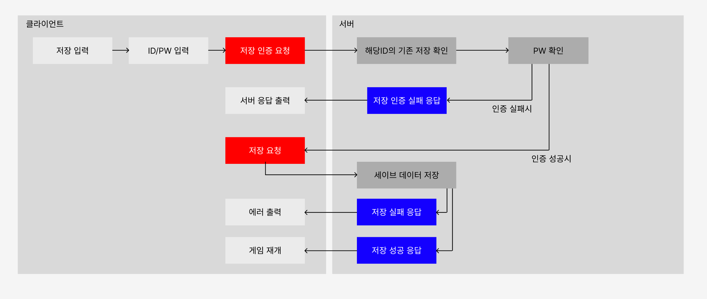
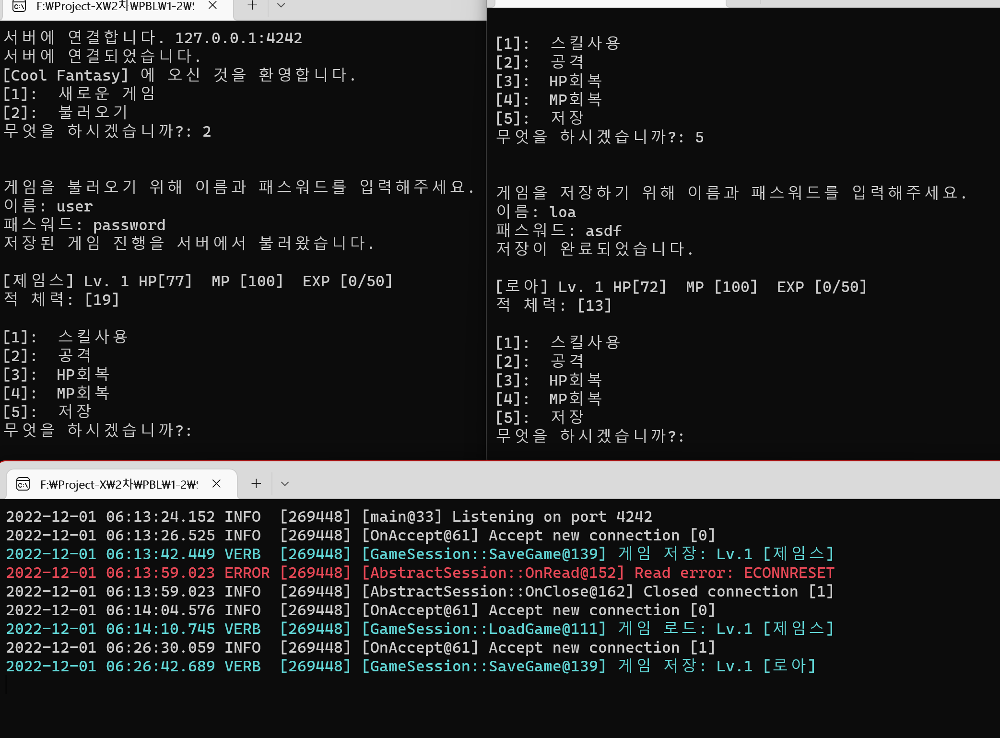

# 1. 목적

- PBL GAME 1-2
- **‘직렬화’ 및 ‘역직렬화’** 기법을 통해 해소하고, **I/O 작업의 기초 숙지.**
- 네트워크를 통해 데이터를 송수신 하는 방법 숙지.

## 1-1. 실제 게임에서의 ‘저장’ 기능의 이점

- 게임 오버 등에 의한 게이머의 **스트레스 관리**
- **게임을 계속 시도할 수 있게 장려**
    - 게이머의 선택을 번복할 기회를 제공
    - 도전욕구 자극
- 긴 플레이 타임의 가능화 → **몰입감 증대**
- [게임 세이브 - 위키백과, 우리 모두의 백과사전 (wikipedia.org)](https://ko.wikipedia.org/wiki/%EA%B2%8C%EC%9E%84_%EC%84%B8%EC%9D%B4%EB%B8%8C)

## 1-2. 실제 게임에서의 ‘네트워크’ 기능의 이점

### (1) 기대 수익

- 멀티플레이
    - 게임성 증대 → **게임의 가치 상승**
    - 흥미 유발 → **게임의 가치 상승**
- 서비스 주체자와 통신
    - 게임 내 재화 판매 (인게임/인앱 결제 등) → **수익**
    - 게임 내 지표를 확인하기 위한 통계 → **상품의 수명 연장** → **기대 수익**

## 1-3. 네트워크 기능을 가진 게임

- **중독성**
    - 유저가 계속 그 게임을 붙들고 플레이하도록 유도.
        - **상품(게임)의 가치 상승 → 추가적인 수익 기대**
- **보안성**
    - **게임의 수명 증대 → 지속적인 수익 보호**
        - 게임 프로그램이 크래킹되어도 서버의 중요한 로직은 안전.
        - 악성 유저를 차단하기 용이.
- **편의성**
    - **어느 클라이언트에서도** 내 캐릭터에 접속 가능
        - 유저로 하여금 게임에 ‘자신의 분신’ 이라는 **몰입**
- **콘텐츠**
    - PVP
        - 정해진 패턴이 아닌 **변칙적인 경우의 수**가 생겨나므로 **흥미 유발**
        - **경쟁심**을 유발시켜 계속 하고 싶게 만드는 **중독성**
            - **하지만 잘못 설계될 경우,** 오히려 **박탈감**.
    - Co-op
        - 어려운 적을 클리어한다는 **성취감, 정복감**
        - 동료와 함께 함으로써, **각자의 역할을 수행함**으로써 즐거움 유발.

- [온라인게임, 유저 이탈 막으려면? "유저 간의 소통이 중요" (thisisgame.com)](https://www.thisisgame.com/webzine/nboard/4/?n=70777)
    - [온라인 게임 - 나무위키 (namu.wiki)](https://namu.wiki/w/%EC%98%A8%EB%9D%BC%EC%9D%B8%20%EA%B2%8C%EC%9E%84)
    - [온라인 게임 - 위키백과, 우리 모두의 백과사전 (wikipedia.org)](https://ko.wikipedia.org/wiki/%EC%98%A8%EB%9D%BC%EC%9D%B8_%EA%B2%8C%EC%9E%84)
- [유저들은 왜 PVP를 원하는가? (gamemeca.com)](https://www.gamemeca.com/view.php?gid=36138)
- [게임은 왜 재미있는가? 4가지 흥미 요소 (tistory.com)](https://dalkomit.tistory.com/152)
- [라이브옵스(LiveOps)가 뭐지? (brunch.co.kr)](https://brunch.co.kr/@tentuplay/11)

# 2. 필요한 기능 및 기술

- **저장 & 불러오기 기능.**
    
    
    | 항목 | 특징 |
    | --- | --- |
    | 저장 가능 시점 | 항상 |
    | 불러오기 가능 시점 | 최초 게임 시작시에만 1회 |
    | 저장 내용 | 게임 Seed, 현재 캐릭터 정보, 적 체력 |
    | 저장 데이터 포맷 | Plain Text, CSV, XML, JSON, Binary Data, … |
- **서버와 통신 기능.**
    
    
    | 항목 | 내용 | 비고 |
    | --- | --- | --- |
    | 서버당 목표 동접 | 2,000 | 변동 가능 |
    | 프로토콜 | HTTP 및 파생, TCP (Custom Protocol, protobuf, …) |  |
- **서버에 게임 진행 상황을 저장 가능.**
    - 계정 인증 기능
        - 저장 시 이름, 패스워드 입력 필요.
            - 이미 존재하는 이름일 경우, 패스워드가 다르면 저장 불가
            - 이미 존재하는 이름이며 패스워드 일치 시 덮어쓰기
        - 로드 시 이름, 패스워드 입력 필요.
        - 한 번 저장하거나 로드된 이후부터는 이름 및 패스워드 다시 묻지 않음.
    - 해킹에 대한 보안
        - **선제적 대응을 통해 추가적인 비용 방지**
            - 신뢰성, 이용자의 박탈감 방지
        - **서비스 국가(대한민국)의 제도 및 규제**
            - [정보통신망 이용촉진 및 정보보호 등에 관한 법률](https://www.law.go.kr/%EB%B2%95%EB%A0%B9/%EC%A0%95%EB%B3%B4%ED%86%B5%EC%8B%A0%EB%A7%9D%EC%9D%B4%EC%9A%A9%EC%B4%89%EC%A7%84%EB%B0%8F%EC%A0%95%EB%B3%B4%EB%B3%B4%ED%98%B8%EB%93%B1%EC%97%90%EA%B4%80%ED%95%9C%EB%B2%95%EB%A5%A0) (정보통신망법)
            - [개인정보 보호법](https://www.law.go.kr/%EB%B2%95%EB%A0%B9/%EA%B0%9C%EC%9D%B8%EC%A0%95%EB%B3%B4%EB%B3%B4%ED%98%B8%EB%B2%95)

# 3. 고려 사항

- 멀티플렉싱 및 고가용성
    - **유지비용의 절감**
        - 데이터 통신량과 코드의 최적화
        - 단일 서버로 최대한 많은 접속자 수용이 가능
- 안정성, 보안
    - 해킹에 대한 보안
        - **선제적 대응을 통해 추가적인 비용 방지**
            - 신뢰성, 이용자의 박탈감 방지
        - **서비스 국가(대한민국)의 제도 및 규제**
            - [정보통신망 이용촉진 및 정보보호 등에 관한 법률](https://www.law.go.kr/%EB%B2%95%EB%A0%B9/%EC%A0%95%EB%B3%B4%ED%86%B5%EC%8B%A0%EB%A7%9D%EC%9D%B4%EC%9A%A9%EC%B4%89%EC%A7%84%EB%B0%8F%EC%A0%95%EB%B3%B4%EB%B3%B4%ED%98%B8%EB%93%B1%EC%97%90%EA%B4%80%ED%95%9C%EB%B2%95%EB%A5%A0) (정보통신망법)
            - [개인정보 보호법](https://www.law.go.kr/%EB%B2%95%EB%A0%B9/%EA%B0%9C%EC%9D%B8%EC%A0%95%EB%B3%B4%EB%B3%B4%ED%98%B8%EB%B2%95)
    - 안정성
        - **통신 서비스의 근간**
            - 서비스의 신뢰성 확보
                - 낮은 다운타임 (Low/Near Zero Downtime)
                - 낮은 응답시간 (Low Latency)
            - 서버-클라이언트 모델에서 이용자가 느끼는 불쾌감 최소화
                - 부하 분산 (Load Balance)
                - 모니터링 (Monitoring
        - [안정적인 서비스 운영을 위한 정리 (tistory.com)](https://bscnote.tistory.com/102)
- 프로토콜
    - 데이터 규격 변경에 용이할 것 → **유지보수 및 추가 개발 비용의 절감**
    - 안정적인 프로토콜일 것 → **유지보수 비용 절감**
- 유지보수
    - 유지보수가 유리할 것
        - **유지보수에 드는 리소스 최소화 → 아낀 리소스 재투자 가능 / 과다업무 방지** ~~(워라밸)~~
    - 서비스 단계의 변수 최소화
        - **라이브 중 예기치 않은 문제 최소화**
            - 제공자에 대한 신뢰성 ↑
            - **대응책, 보상책을 마련하는 비용을 미리 아낀다는 보험.**
        - 철저한 테스트
            - 자동화 테스트
                - 협업 시 발생할 수 있는 문제를 사전에 어느 정도 캐치
                - 테스트를 믿고, 안심하고 리팩토링 가능
                - 작성한 코드가 문제가 없음을 테스트를 통해 객관적으로 증명 가능
    - CI(지속적 통합)/CD(지속적 구축) 시스템 구축
        - 배포 단계에서 발생할 수 있는 실수를 최소화
        - 빠른 템포로 배포가 가능 → **서비스 다운 타임(점검 시간)의 최소화**

# 4. 데이터 저장 포맷

## 4-1. 이진 데이터 방식

Binary File.

- 데이터의 저장과 처리를 목적으로, **실제 프로그램이 주기억장치에 올리는 규격과 동일**.
- 텍스트 파일 형태와 비교해, (문자열과의) 포맷 변환이 불필요 → **월등한 성능**
- 일반적으로 사람이 읽어낼 수 없음 → **최소한의 보안성**

## 4-2. 저장 데이터 구성

- 게임 데이터를 저장하는 **구조체를 파일로 그대로 마샬링** 하는 방식

### 1) 장점

- 텍스트 파일과 비교해, 사람이 직접 읽을 수 없기에 → **임의 수정을 막는 최소한의 보안 장치**
- 파일을 읽어 그대로 구조체로 해석하면 되므로 → **컴퓨터 입장에서 월등한 성능**
- 별도로 저장 규격을 정의하지 않아도 됨. → **개발 편의성**

### 2) 단점

- 버전 관리 어려움 → **구조체에 세이브 파일의 버전을 기입하는 방식으로 해결**
- 디버깅 어려움 → **직렬화 코드를 한눈에 검증 가능하게끔 코드를 작성하여 해결**

# 5. 전송 프로토콜

## (1) 고려사항

- **신뢰성**
    - 세이브 데이터 저장이므로. → **TCP 기반**
- **비용대비 가벼운 서버**
    - Stateless지만, **HTTP 프로토콜 미채택.**
        - 복잡한 HTTP 프로토콜 구현체는 무거움.
        - HTTP를 반드시 택해야 하는 이유가 없음.
    - protobuf 비채택.
        - 크로스플랫폼 프로젝트가 아님 → 불필요
    - 크기가 큰 세이브 데이터 전송 최소화
        - 세이브 데이터를 매번 보내지 않고, 허용되었을 때만 보냄.
- **바퀴의 재발명 방지**
    - libuv 라이브러리 활용. → **‘프로토콜’ 및 ‘로직’에 집중하기 위함.**
- **최소한의 보안**
    - 패킷 스니핑에 대한 기초적인 방어 ([스니핑(Sniffing) 공격 : 네이버 블로그 (naver.com)](https://m.blog.naver.com/wnrjsxo/221115871221))
    - 추후 암호화 알고리즘을 채택하여 삽입할 수 있는 Placeholder 준비
- [게임 서버의 2가지 기술 [1 / 4], 실시간 게임서버 (Stateful) 와 비동기 게임서버 (Stateless) – 프로카데미, 게임서버 개발 이야기 (procademy.co.kr)](http://post.procademy.co.kr/archives/624)

## (2) 프로토콜 자료형 정의

- 변수 자료형 정의

## (3) 패킷 헤더

- 패킷 헤더는 모든 메시지마다 항상 맨 앞에 붙으며, 다음과 같은 정보를 담는다.

```cpp
uint16_t: 헤더 길이를 제외한 패킷 길이
uint16_t: 메시지 코드
enum ServerToClient {
  ServerToClient_LoadRes,
  ServerToClient_SaveAuthRes,
  ServerToClient_SaveRes
};
enum ClientToServer {
  ClientToServer_LoadReq,
  ClientToServer_SaveAuthReq,
  ClientToServer_SaveReq
};
```

## (4) 서버 → 클라이언트

```cpp
enum AuthError {
  AuthError_Success,             // 오류가 없는 성공
  AuthError_EmptyValue,          // 아이디 또는 패스워드가 비어있음
  AuthError_InvalidPassword,     // 로그인 실패 (계정은 존재하나, 패스워드 틀림)
  AuthError_NoAccount,           // 해당 계정으로 아이디 없음
  AuthError_InternalServerError  // 파일 입출력 관련 에러 발생
};
```

- 불러오기 응답

```cpp
bool: 성공 실패
if (성공) {
  구조체 GameData: 서버에 저장된 세이브 데이터
}
else {
  int8_t: 실패 이유
}
```

- 저장 가능 응답

```cpp
bool: 성공 실패
if (!성공) {
  int8_t: 실패 이유
  enum SaveAuthError {
    SaveAuthError_InvalidPassword      // 로그인 실패 (계정이 이미 존재하며, 패스워드 틀림)
  };
}
```

- 저장 응답

```cpp
bool: 성공 실패
if (!성공) {
  int8_t: 실패 이유
  enum SaveError {
    SaveError_InternalServerError  // 파일 입출력 관련 오류 발생
  };
}
```

## (5) 클라이언트 → 서버

- 불러오기 요청

```cpp
string: 계정이름
string: 패스워드
```

- 저장 인증 요청

```cpp
string: 계정이름
string: 패스워드
```

- 저장 요청

```cpp
구조체 GameData: 저장할 세이브 데이터
```

## (6) 흐름도



# 6. 구현

## (1) 입출력

**직렬화(Serialize)**란, 자료구조(컨테이너) 또는 객체를 동일한, 또른 다른 프로세스나 컴퓨터에게 보내고 저장할 수 있도록 변환하는 과정. 일반적으로, 일련의 바이트 배열로 변환.

**역직렬화(Deserialize)**는, 바이트 배열 등지로 변환된 기존의 컨테이너나 객체를, 원래의 데이터 포맷으로 다시 재구성하여 추출하는 작업.

객체를 파일로 저장하고 읽는 과정은 **필연적으로 직렬화 및 역직렬화 과정을 거침.** 따라서, 이번 과제에서는 직렬화 및 역직렬화 과정을 어떻게 할 것인지에 대한 고민.

직렬화 및 역직렬화 과정은 **안전하고, 간편**해야 한다고 생각**.** 많은 정보를 작성하고 읽는데에 오류가 있어서는 안되며, 이 과정을 개발자가 구현하기도 어렵지 않아야 할 듯.

### 1) 파일 I/O

그나마 **파일 I/O**는 동기-블로킹 방식으로 읽고 쓰기 때문에, 개발과정에서 신경 쓸 부분이 적었음.

- **I/O 작업의 예외 처리**

그래서 위 하나만 제대로 처리해주면, 나머지는 직렬화 코드가 책임질 영역. 그러나 **읽고 쓸 파일의 크기가 커지거나, 동시에 다량의 파일을 처리해야 한다면** 이야기가 달라진다. 여기서 부터는 파일 I/O도 네트워크와 마찬가지로 성능 문제에 의해 논블로킹 및 비동기 방식이 사실 강제된다고 볼 수 있다.

### 2) 비동기 및 논블로킹 I/O

네트워크 프로그래밍, 특히 서버에서 매우 자주 활용.

**느려터진 I/O를 CPU가 무한정 대기하는 것이 아닌, 그 사이 유용한 다른 일을 하기 위해 사용.**

- 1024 바이트를 SSD에서 읽어내는 것을 CPU는 **4047사이클 동안 아무 일도 안하고 대기**.
- **4047 사이클이면 덧셈을 4047번 할 수 있는 소중한 자원.**

TCP 및 파일 모두 일반적으로 스트림 형태로 API가 제공되므로, 버퍼링과 자주 함께 활용됨.

비동기는 일반적으로 **Callback을 활용해 완료 시점에 다음 작업을 미리 등록**하고, 나중에 실행을 예정하는 형태. 현대 프로그래밍 언어들은 `Future`(Java), `Promise`(JavaScript), `Task`(C#) 등 비동기에 활용되는 API가 제공됨.

논블로킹은 **I/O 작업의 진행 상황과 상관 없이**, 즉시, 완료를 반환하여 **호출자가 제어권을 유지**하는 형태임. 즉 **실제 I/O 작업은 백그라운드에서 여전히 진행**되나, 호출자가 제어권을 즉시 가져온다는 차이.

libuv는 자체적으로 추상화한 이벤트형 모델을 통해, `IOCP`, `kqueue`, `epoll` 등 각 운영체제의 API를 활용하여 **고성능 비동기 논블로킹 I/O**를 구현.

### 3) 버퍼링

데이터를 한 번에 처리하지 않고, 임시 저장소(버퍼)에 쌓은 다음, 원하는 만큼 데이터가 확보되면 처리하는 방식. 스트림 형태의 I/O는 읽기 작업 시에 read 작업 한 번만에 모든 데이터를 가져오지 못할 수 있음.

소켓으로 데이터를 읽을 때, `PacketBuffer` 를 활용하여, 이번에 읽어온 데이터를 계속 쌓아뒀다가, 데이터를 처리할 수 있을 만큼이 쌓이면(=하나의 메시지 단위가 채워지면) 하나의 메시지를 해당 버퍼에서 빼내어서 메시지를 처리하고, 다음 메시지가 채워질 때 까지 read 작업을 계속 함.

## (2) 후기

흐름도도 있고, 프로토콜도 정했고, libuv를 활용해 간단하게 로직에 집중하겠다고 마음먹었으나, 생각보다 순탄치 않았다.

libuv의 특성에 기인했는데, libuv는 완전한 비동기 라이브러리기 때문에, 싱글 스레드의 콘솔 형태로 간단하게 구현했던 내 SimpleRPG 프로그램에서 비동기를 엮는 것이 다소 난해할 수 밖에 없었다.

이를 해결하기 위해 **소켓 이벤트를 처리하는 스레드를 따로 두고**, 메인 스레드를 WAIT상태로 만들어서 해결했다. 원하는 처리가 소켓을 통해 다 되면, 메인 스레드를 깨워서 나머지 작업을 이어서 할 수 있게 한 것이다.

그래서 비동기를 활용하는 것 때문에 원래 생각했던 것 보다 코드가 복잡해졌다. 조금 더 시간이 주어졌다면 코드를 좀 더 깔끔하게 설계할 수 있었을까 하는 아쉬움이 남는다.

기존 파일로 저장 및 로드하는 코드에서 달라진 점은 다음과 같다.

1. [불러오기] 기능을 선택하면, 이름 및 패스워드를 묻는다.
2. [저장] 기능을 선택하면, 이름 및 패스워드를 묻고, 해당 정보로 서버에서 인증이 성공하면 게임 데이터를 보내 저장을 요청한다.
3. [불러오기] 또는 [저장]을 한 번이라도 성공했다면, 이후에는 해당 세션에 대해서 추가적으로 이름 및 패스워드를 묻지 않는다.



libuv를 활용했기 때문에, 고가용성 비동기 논블로킹 서버로 구현 되었다. 덕분에, 동시에 여러 클라이언트를 수용할 수 있으며, 현재는 최대 2000개의 커넥션으로 연결을 제한하였다.
