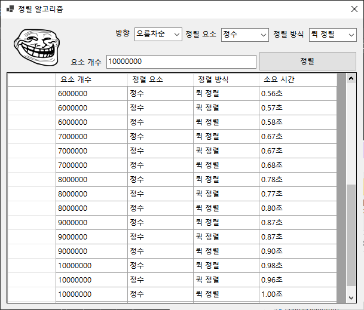

# 1. 삽입정렬

| 요소 개수 | 정렬 요소 | 정렬 방식 | 소요 시간 |
| --- | --- | --- | --- |
| 20000 | 정수 | 삽입 정렬 | 0.11초 |
| 30000 | 정수 | 삽입 정렬 | 0.25초 |
| 50000 | 정수 | 삽입 정렬 | 0.72초 |
| 70000 | 정수 | 삽입 정렬 | 1.39초 |
| 60000 | 정수 | 삽입 정렬 | 1.01초 |
| 120000 | 정수 | 삽입 정렬 | 4.11초 |
| 240000 | 정수 | 삽입 정렬 | 16.45초 |
| 480000 | 정수 | 삽입 정렬 | 68.40초 |
| 720000 | 정수 | 삽입 정렬 | 166.95초 |

# 2. 퀵정렬

| 요소 개수 | 정렬 요소 | 정렬 방식 | 소요 시간 |
| --- | --- | --- | --- |
| 1000000 | 정수 | 퀵 정렬 | 0.09초 |
| 1000000 | 정수 | 퀵 정렬 | 0.09초 |
| 1000000 | 정수 | 퀵 정렬 | 0.09초 |
| 2000000 | 정수 | 퀵 정렬 | 0.18초 |
| 2000000 | 정수 | 퀵 정렬 | 0.18초 |
| 2000000 | 정수 | 퀵 정렬 | 0.18초 |
| 3000000 | 정수 | 퀵 정렬 | 0.28초 |
| 3000000 | 정수 | 퀵 정렬 | 0.28초 |
| 3000000 | 정수 | 퀵 정렬 | 0.28초 |
| 4000000 | 정수 | 퀵 정렬 | 0.37초 |
| 4000000 | 정수 | 퀵 정렬 | 0.37초 |
| 4000000 | 정수 | 퀵 정렬 | 0.38초 |
| 5000000 | 정수 | 퀵 정렬 | 0.47초 |
| 5000000 | 정수 | 퀵 정렬 | 0.47초 |
| 5000000 | 정수 | 퀵 정렬 | 0.48초 |
| 6000000 | 정수 | 퀵 정렬 | 0.56초 |
| 6000000 | 정수 | 퀵 정렬 | 0.57초 |
| 6000000 | 정수 | 퀵 정렬 | 0.58초 |
| 7000000 | 정수 | 퀵 정렬 | 0.67초 |
| 7000000 | 정수 | 퀵 정렬 | 0.67초 |
| 7000000 | 정수 | 퀵 정렬 | 0.68초 |
| 8000000 | 정수 | 퀵 정렬 | 0.78초 |
| 8000000 | 정수 | 퀵 정렬 | 0.77초 |
| 8000000 | 정수 | 퀵 정렬 | 0.80초 |
| 9000000 | 정수 | 퀵 정렬 | 0.87초 |
| 9000000 | 정수 | 퀵 정렬 | 0.87초 |
| 9000000 | 정수 | 퀵 정렬 | 0.90초 |
| 10000000 | 정수 | 퀵 정렬 | 0.98초 |
| 10000000 | 정수 | 퀵 정렬 | 0.96초 |
| 10000000 | 정수 | 퀵 정렬 | 1.00초 |

---

# 3. 삽입정렬 vs 퀵정렬

|  | 평균 시간 복잡도 | 최선의 시나리오 | 최악의 시나리오 |
| --- | --- | --- | --- |
| 삽입 정렬 | O(N^2) | O(N) | O(N^2) |
| 퀵 정렬 | θ(N log N) | θ(N log N) | O(N^2) |

## 1) 삽입정렬

- 최선의 경우, 모든 경우에 대해서 한 번씩만 비교를 진행하므로 O(N)으로써 엄청나게 빠른 성능.
- 준수한 성능으로 다른 정렬 알고리즘의 일부로 사용되기도 함.
- 데이터의 상태에 따라 성능 편차가 굉장히 심함.

## 2) 퀵 정렬

- 평균적으로 매우 준수한 성능을 보여줌.
- 분할 정복 방법에 따라 더 나은 성능으로 최적화 가능.
- Pivot에 따라 성능 편차가 심함. 최악의 경우의 Pivot일 경우, O(N^2)의 시간 복잡도.